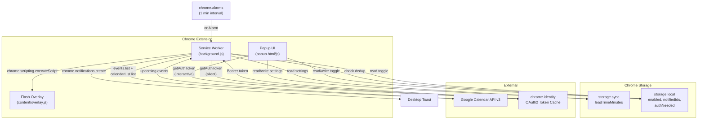
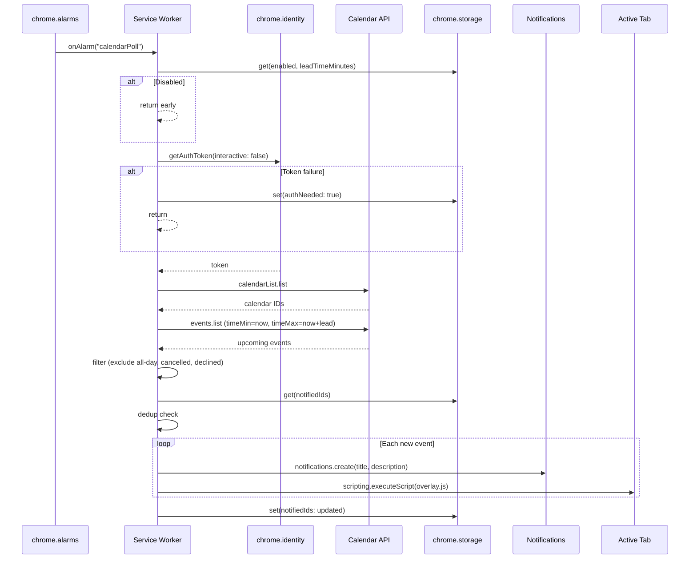

# Google Calendar Meeting Reminder - Plan

---

## Goal Capsule

- **Objective:** Build a Chrome Manifest V3 extension that monitors Google Calendar and alerts the user with screen flash + toast notification when meetings approach.
- **Authority:** This plan is the implementation guide. The user's original request defines product scope.
- **Stop conditions:** All six implementation units pass their verification criteria; the extension loads in Chrome, authenticates, polls, and delivers notifications reliably.
- **Execution profile:** Greenfield — no existing code. Standard JavaScript, no build tooling required for v1.

---

## Product Contract

### Summary

A Chrome extension that connects to Google Calendar via OAuth2 and notifies the user when meetings are approaching, using both a visual screen flash and a desktop toast notification with meeting details. Configurable lead time and on/off toggle.

### Problem Frame

Developers and knowledge workers miss meetings because calendar tabs are buried or minimized. Native Google Calendar notifications are easy to dismiss or ignore. An attention-grabbing browser-level alert — a screen flash combined with an OS-level toast showing meeting title and description — provides a harder-to-miss reminder without requiring a separate app.

### Requirements

**Core notification behavior**

- R1. Poll Google Calendar for upcoming timed events and fire a notification when a meeting is within the configured lead time window.
- R2. Display a desktop toast notification showing the meeting title and an abbreviated description (first ~100 characters).
- R3. Flash the active browser tab with a brief color overlay as a visual attention signal.
- R4. Deduplicate notifications so a given meeting triggers at most one alert per notification window.

**Authentication**

- R5. Authenticate with Google via OAuth2 using `chrome.identity`, requesting read-only calendar access.
- R6. Handle token expiry and revocation gracefully — re-prompt for auth via the popup when silent token retrieval fails.

**Configuration**

- R7. Provide an on/off toggle for notifications (per-device, stored in `chrome.storage.local`).
- R8. Provide a configurable lead time in minutes (1-60, default 5, synced across devices via `chrome.storage.sync`).

**Event filtering**

- R9. Monitor all calendars the user has visible (where `selected: true` in Calendar List API).
- R10. Exclude all-day events, cancelled events, and events the user has declined.

### Scope Boundaries

**In scope:** Chrome extension with popup UI, background polling, desktop notifications, screen flash overlay, Google Calendar read-only integration.

**Not in scope:**
- Creating, editing, or deleting calendar events
- Multi-browser support (Firefox, Safari, Edge)
- Snooze or reminder-later functionality
- Calendar view or agenda display within the extension
- Google Calendar push/watch API (requires a server endpoint)
- Multi-account calendar aggregation (extension uses the Chrome profile's signed-in account)

#### Deferred to Follow-Up Work

- Notification sound configuration
- Per-calendar notification filtering (enable/disable per calendar)
- "Join meeting" button in notification (requires `hangoutLink`/`conferenceData` parsing)
- `requireInteraction` as a user-configurable setting

---

## Planning Contract

### Key Technical Decisions

KTD-1. **Manifest V3 with service worker** — MV3 is required (MV2 is being sunset). The background service worker is ephemeral (~30s lifetime), so all state must live in `chrome.storage`. Event listeners must be registered synchronously at the top level of the service worker file.

KTD-2. **`chrome.alarms` at 1-minute interval for polling** — `chrome.alarms` is the only reliable periodic wake mechanism in MV3. The minimum enforced interval is 1 minute, which is sufficient for lead times of 1-60 minutes. `setInterval`/`setTimeout` do not survive worker termination.

KTD-3. **`chrome.identity.getAuthToken` for OAuth2** — handles token caching and refresh internally. Interactive auth (consent screen) only from popup via user gesture. Background polling uses `getAuthToken({ interactive: false })` and flags auth failures in storage for the popup to surface.

KTD-4. **Dynamic content script injection via `chrome.scripting.executeScript`** — avoids static `content_scripts` declaration (which would inject on every page load). Requires `scripting` permission and `host_permissions` for the target tab URL. Protected pages (`chrome://`, `chrome-extension://`) silently fail; the toast notification serves as the reliable fallback.

KTD-5. **Split storage strategy** — `chrome.storage.sync` for lead time setting (syncs across devices). `chrome.storage.local` for on/off toggle (per-device), notified-event-IDs set (transient dedup state), and auth failure flag. This avoids the surprising behavior of disabling notifications on all devices when toggled off on one.

KTD-6. **`<all_urls>` host permission for screen flash** — required to inject the overlay content script into arbitrary active tabs. This triggers a broad permission warning in Chrome Web Store review but is necessary for the screen flash feature. The overlay script is injected on-demand only, not on every page load.

KTD-7. **`calendar.readonly` OAuth scope** — the narrowest scope that covers both `calendarList.list` and `events.list`. Do not request full `calendar` read/write access.

### Assumptions

- The extension will be used in a single Chrome profile per device (no multi-profile aggregation).
- The user has a Google account signed into their Chrome profile.
- 1-minute polling granularity is acceptable (meetings added with less than 1 minute notice may be missed).

---

## High-Level Technical Design





---

## Output Structure

```
chrome-mtg-reminder/
  manifest.json
  background.js              # Service worker: alarms, polling, notifications
  popup/
    popup.html               # Extension popup UI
    popup.js                 # Settings + auth logic
    popup.css                # Popup styling
  content/
    overlay.js               # Screen flash overlay (injected on demand)
  icons/
    icon16.png
    icon48.png
    icon128.png
  tests/
    background.test.js       # Polling, filtering, dedup logic tests
    popup.test.js            # Settings read/write tests
```

---

## Implementation Units

### U1. Project Scaffold and Manifest

**Goal:** Create the extension file structure with a valid Manifest V3 configuration that declares all required permissions and the OAuth2 client ID placeholder.

**Requirements:** Foundation for R1-R10.

**Dependencies:** None.

**Files:**
- `manifest.json`
- `icons/icon16.png`, `icons/icon48.png`, `icons/icon128.png` (placeholder PNGs)
- `background.js` (empty service worker shell)
- `popup/popup.html`, `popup/popup.js`, `popup/popup.css` (empty shells)
- `content/overlay.js` (empty shell)

**Approach:** Manifest declares `permissions: [identity, alarms, notifications, storage, scripting]`, `host_permissions: [https://www.googleapis.com/*, <all_urls>]`, `oauth2` section with client ID placeholder and `calendar.readonly` scope, `background.service_worker` pointing to `background.js` with `type: module`, `action.default_popup` pointing to `popup/popup.html`, and an explicit `content_security_policy` for extension pages restricting to `script-src 'self'; object-src 'none'` (MV3 default, but declared explicitly to prevent future relaxation).

**Patterns to follow:** Standard Chrome Extension Manifest V3 structure.

**Test scenarios:**
- Test expectation: none -- scaffolding only. Verified by loading in Chrome.

**Verification:** Extension loads in `chrome://extensions` with developer mode enabled, shows the popup shell, and reports no manifest errors.

---

### U2. Settings UI and Storage

**Goal:** Build the popup interface with an on/off toggle and lead time input, backed by `chrome.storage`.

**Requirements:** R7, R8.

**Dependencies:** U1.

**Files:**
- `popup/popup.html` (modify)
- `popup/popup.js` (modify)
- `popup/popup.css` (modify)
- `tests/popup.test.js` (create)

**Approach:** Popup reads settings on open from `chrome.storage.local` (enabled toggle) and `chrome.storage.sync` (leadTimeMinutes). Toggle is a checkbox; lead time is a number input clamped to 1-60. On change, write to the appropriate storage area. The service worker listens to `chrome.storage.onChanged` to react to toggle changes (create/clear the polling alarm). On first install (`chrome.runtime.onInstalled` with `reason === "install"`), write defaults: `{ enabled: true }` to local, `{ leadTimeMinutes: 5 }` to sync.

**Patterns to follow:** `chrome.storage.sync.get` with defaults object pattern.

**Test scenarios:**
- Happy path: open popup, toggle is checked (enabled), lead time shows 5. Change lead time to 10, reopen popup — value persists as 10.
- Happy path: uncheck toggle, reopen popup — toggle remains unchecked.
- Edge case: enter 0 in lead time field — clamped to 1. Enter 100 — clamped to 60.
- Edge case: enter non-numeric value — field rejects input or falls back to default.
- Edge case: first install with no prior storage — defaults applied (enabled: true, leadTimeMinutes: 5).

**Verification:** Settings persist across popup open/close cycles. Invalid input is rejected or clamped. Defaults are correct on fresh install.

---

### U3. OAuth2 Authentication Flow

**Goal:** Implement Google sign-in via `chrome.identity` with a popup sign-in button and background-safe silent token retrieval.

**Requirements:** R5, R6.

**Dependencies:** U1.

**Files:**
- `popup/popup.html` (modify)
- `popup/popup.js` (modify)
- `background.js` (modify — add token helper)

**Approach:** Popup shows a "Sign in with Google" button when no valid token exists. Clicking it calls `chrome.identity.getAuthToken({ interactive: true })`. On success, the popup transitions to the settings view (U2). The background service worker exposes a `getToken()` helper that calls `getAuthToken({ interactive: false })`. On 401 from the Calendar API, it calls `chrome.identity.removeCachedAuthToken({ token })` and retries once. If retry fails, it sets `authNeeded: true` in `chrome.storage.local` — the popup reads this flag and shows the re-auth prompt. The popup clears `authNeeded` after successful interactive auth.

**Patterns to follow:** `chrome.identity.getAuthToken` with promise wrapper. 401 → `removeCachedAuthToken` → retry pattern.

**Test scenarios:**
- Happy path: user clicks sign-in, consent screen completes, token returned, popup shows settings.
- Happy path: background calls `getAuthToken({ interactive: false })` — returns cached token silently.
- Error path: user closes consent screen without completing — `chrome.runtime.lastError` set, popup shows sign-in button.
- Error path: token revoked externally (user revokes in Google Account settings) — 401 from API, token removed, `authNeeded` flag set, popup shows re-auth prompt.
- Error path: background `getAuthToken({ interactive: false })` fails (no cached token) — sets `authNeeded` flag, does not attempt interactive auth.

**Verification:** Sign-in flow completes and token is usable for Calendar API calls. Token revocation triggers re-auth prompt in popup. Background never shows interactive consent.

---

### U4. Calendar Polling Engine

**Goal:** Implement the background polling loop that fetches upcoming events, filters them, and triggers notifications via message passing.

**Requirements:** R1, R4, R9, R10.

**Dependencies:** U1, U2 (reads settings), U3 (needs auth token).

**Files:**
- `background.js` (modify)
- `tests/background.test.js` (create)

**Approach:**

Alarm setup: `chrome.runtime.onInstalled` and `chrome.runtime.onStartup` check for existing `calendarPoll` alarm; create with `periodInMinutes: 1` if missing. `chrome.storage.onChanged` listener clears the alarm when `enabled` flips to `false` and re-creates when flipped to `true`.

Poll cycle (`chrome.alarms.onAlarm`):
1. Read `enabled` from `storage.local` and `leadTimeMinutes` from `storage.sync` — return early if disabled.
2. Get token via `getToken()` (U3).
3. Call `calendarList.list` to get all calendars where `selected: true`. Cache calendar IDs in `storage.local` with a 1-hour TTL to reduce API calls.
4. For each calendar, call `events.list` with `timeMin=now`, `timeMax=now+leadTimeMinutes`, `singleEvents=true`, `orderBy=startTime`, `fields=items(id,summary,description,start,end,status,attendees,hangoutLink)`.
5. Filter: exclude events where `start.date` exists (all-day), `status === "cancelled"`, or the user's attendee entry has `responseStatus === "declined"`. Identify the user by matching attendee email to the `self: true` attendee.
6. Dedup: read `notifiedIds` from `storage.local` (a map of `eventId → startDateTime`). Skip events already in the map. Add new events to the map. Clean entries older than 24 hours.
7. For each new event: trigger notification (U5) and screen flash (U6).

**Patterns to follow:** All listeners registered synchronously at top level. State in `chrome.storage`. `singleEvents=true` for recurring event expansion.

**Test scenarios:**
- Happy path: alarm fires, token valid, 1 meeting in 4 minutes on primary calendar — event returned and passed to notification trigger.
- Happy path: 2 meetings across 2 calendars within lead window — both returned.
- Edge case: all-day event within time window — excluded from results.
- Edge case: cancelled event within window — excluded.
- Edge case: declined event within window — excluded.
- Edge case: tentative event (not declined, not cancelled) — included.
- Edge case: recurring weekly meeting — `singleEvents=true` expands it; individual instance ID used for dedup.
- Edge case: same event polled on consecutive alarm cycles — dedup prevents re-notification.
- Edge case: notifiedIds contains entries older than 24 hours — cleaned up on poll.
- Error path: `getAuthToken` fails — sets `authNeeded` flag, poll aborts gracefully.
- Error path: Calendar API returns 401 — token removed, retry once, set `authNeeded` if retry fails.
- Error path: Calendar API returns 403 or 429 — log error, skip this cycle, retry on next alarm.
- Integration: alarm fires → reads settings → gets token → calls API → filters → dedup check → triggers notification.

**Verification:** Polling runs every 1 minute when enabled, stops when disabled. Events are correctly filtered and deduplicated. Auth failures surface the re-auth flag.

---

### U5. Desktop Toast Notifications

**Goal:** Create desktop notifications with meeting title and abbreviated description, with click-to-open-event behavior.

**Requirements:** R2.

**Dependencies:** U4 (triggered by polling engine).

**Files:**
- `background.js` (modify — notification creation and event handlers)

**Approach:** Called by U4's poll cycle for each new event. Creates a `chrome.notifications.create` with `type: "basic"`, `title` set to `"Meeting in X minutes"` (computed from event start time vs now), `message` set to event `summary`, and `contextMessage` set to first 100 characters of `description` (or empty if none). Uses `eventId` as part of the notification ID for dedup/update semantics. Registers `chrome.notifications.onClicked` handler to open the Google Calendar event URL (`https://calendar.google.com/calendar/event?eid=<base64_event_id>`) in a new tab and clear the notification.

**Patterns to follow:** `chrome.notifications.create` with `type: "basic"`. Notification ID derived from event ID.

**Test scenarios:**
- Happy path: event with title "Weekly Sync" and description "Discuss Q3 goals and roadmap priorities" — notification shows title "Meeting in 5 minutes", message "Weekly Sync", context "Discuss Q3 goals and roadmap priorities".
- Happy path: user clicks notification — new tab opens with Google Calendar event.
- Edge case: event with no description — notification shows title and summary only, context message is empty.
- Edge case: description longer than 100 characters — truncated to 100 chars with "..." suffix.
- Edge case: multiple events trigger in same poll cycle — separate notifications created for each.
- Edge case: notification with same event ID already exists — uses same notification ID (updates in place).

**Verification:** Toast notification appears with correct meeting title and description. Clicking opens the calendar event.

---

### U6. Screen Flash Overlay

**Goal:** Inject a brief color flash overlay into the active tab when a meeting notification fires.

**Requirements:** R3.

**Dependencies:** U4 (triggered by polling engine), U1 (manifest permissions).

**Files:**
- `content/overlay.js` (modify)
- `background.js` (modify — injection trigger)

**Approach:** Called by U4's poll cycle alongside U5. Uses `chrome.tabs.query({ active: true, currentWindow: true })` to find the active tab. Skips if no active tab or if the tab URL starts with `chrome://`, `chrome-extension://`, or `edge://`. Calls `chrome.scripting.executeScript({ target: { tabId }, files: ["content/overlay.js"] })` wrapped in try/catch — silently fails on unscriptable pages. The overlay script is idempotent: checks for existing `#mtg-flash-overlay` element before creating. Creates a full-viewport `position: fixed` div with a semi-transparent colored background, `z-index: 2147483647`, `pointer-events: none`, and a CSS `@keyframes` fade-out animation (~1 second). The overlay self-removes via `setTimeout` after the animation completes. Flash fires once per poll cycle regardless of how many meetings triggered (avoid repeated flashing).

**Patterns to follow:** `chrome.scripting.executeScript` for dynamic injection. Idempotent content script with self-cleanup.

**Test scenarios:**
- Happy path: active tab is a normal webpage — overlay appears, fades, and self-removes within ~1 second.
- Happy path: multiple meetings trigger in same poll cycle — overlay flashes once (not per-meeting).
- Edge case: active tab is `chrome://extensions` — injection skipped silently, toast notification still fires.
- Edge case: active tab is a PDF viewer — injection may fail silently, toast still fires.
- Edge case: no active tab (all windows minimized) — `chrome.tabs.query` returns empty, flash skipped.
- Edge case: overlay script injected twice rapidly — idempotency check prevents duplicate overlays.
- Edge case: page has own `z-index: 2147483647` element — overlay uses max z-index; visual overlap possible but brief.

**Verification:** Overlay flashes and disappears on a normal webpage. No errors on protected pages. Toast notification is always the primary reliable notification path.

---

## Verification Contract

| Gate | Command / Check | Applies to |
|---|---|---|
| Extension loads | Load unpacked in `chrome://extensions` — no manifest errors | U1 |
| Unit tests pass | `node --test tests/background.test.js && node --test tests/popup.test.js` | U2, U4 |
| Manual auth flow | Click sign-in in popup, complete consent, verify token returned | U3 |
| Manual polling | Enable extension, wait 1 minute, verify Calendar API called (DevTools network tab on service worker) | U4 |
| Manual notification | With a meeting within lead time, verify toast appears with correct title/description | U5 |
| Manual flash | With a meeting within lead time, verify overlay appears on active tab and fades | U6 |
| Protected page fallback | Navigate to `chrome://settings`, trigger notification — verify no errors, toast still shows | U6 |
| Settings persistence | Change lead time and toggle, reopen popup — verify values persist | U2 |
| Deduplication | Wait through two consecutive poll cycles with same upcoming meeting — verify single notification | U4 |

---

## Definition of Done

- All implementation units complete and verified against their test scenarios.
- Extension loads in Chrome without manifest errors or console warnings.
- End-to-end flow works: install → sign in → upcoming meeting detected → toast + flash fires → settings toggle and lead time work.
- No OAuth tokens stored outside `chrome.identity`'s internal cache.
- Deduplication prevents repeat notifications for the same meeting.
- Protected pages do not cause errors — flash degrades gracefully to toast-only.
- No abandoned-attempt or dead-end code in the final diff.
